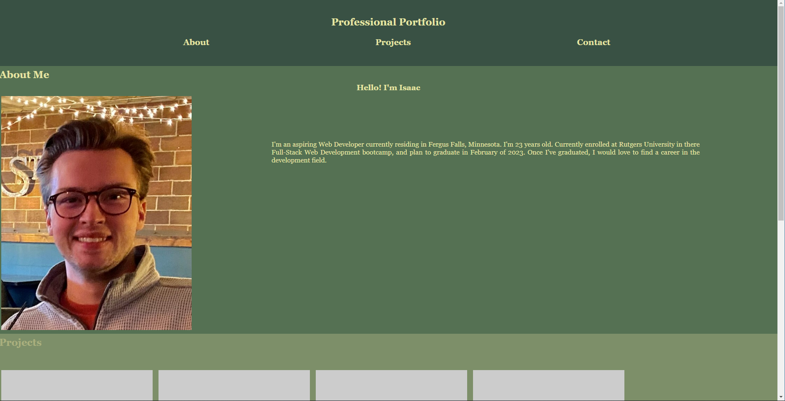
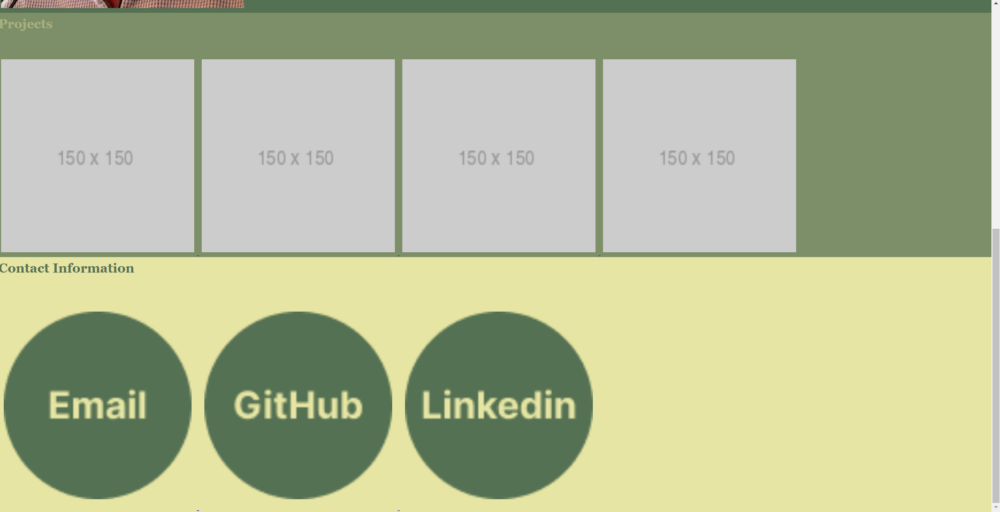

# professional-portfolio

## Description

My motivation for the project is to be able to present this professional portfolio to my future employer and keep adding to the web page to showcase my skill. This task is able to represent my skills to my future employer. I learned many ways to connect HTML and Advanced CSS, linking images, and laying out my site.

## Installation

Use this webpage on any browser

## Usage

## Credits

https://www.w3schools.com/

The Rutger University bootcamp curiculum

Professor Joe Han

TA Paul Cwik

TA Manolis Koutouzos

Some fellow students including Eric Kirberger, Azime Hail, Joseph Sedlak, Justin Yi, and Jonathan Plaras

## License

MIT License,, linked in the repospitory